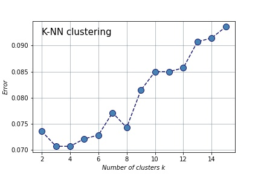
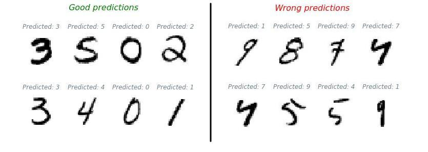

# Objective

The aim of this dataset is to enable a computer to learn how to recognize handwritten numbers automatically. This is particularly useful for scanning information in handwritten documents or for reading cheques, for example.

```python
from sklearn.datasets import fetch_openml
```
The dataset is composed of 7000 B&W images (28x28 pixels) with numbers from 0 to 9.
    


    

## How do we do that?

In the following, we are going to use the K-NN classifier, or k-nearest neighbors classifier. The k (hyperparameter) refers to the number of centroids.

```python
# Separate the train from the test dataset
xtrain, xtest, ytrain, ytest = train_test_split(sampled_data,sampled_target, train_size=0.8)

# Classifier K-NN 
knn = neighbors.KNeighborsClassifier(n_neighbors=3) # k=3
knn.fit(xtrain,ytrain)

ERROR = 1-knn.score(xtest,ytest)

print(ERROR)
```


    0.07071428571428573

In that example, I use a training data set equals to 80% of the dataset, meaning that the testing set is about 20%. Also, I choose an random value of "k" = 3.

The result indicates a really low error → the algorithm arrives to predict the numbers!

## Is k=3 the best hyperparameter?

**Optimisation of the hyperparameter "k"**

To find the best parameter, we can test all the value of k between 2 and 15 and plot the error.

```python
errors = []

for k in range(2,16):
    knn = neighbors.KNeighborsClassifier(k)
    
    errors.append(1-knn.fit(xtrain,ytrain).score(xtest,ytest))

```


The lowest the value, the better the predictions!!
In this example, "k"= 3 indicates the lowest error.

## The results

**Some examples of good predictions and bad predictions**




## Conclusions

- By using a **simple algorithm**, the machine can learn how to classify the handwritten numbers.

- **Implementing a grid search** is often the best solution to determine the best parameters or hyperparameters of our algorithms. This include a **trade-off between computation time and quality** of the results! Is it really necessary to lower the error of 0.1% if the computation time increases of 50%? 

👋👋👋👋