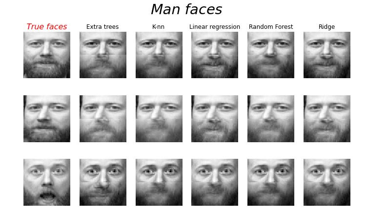

<!-- ```python
import libr
print('hello')
``` -->

## Objectives
The goal is to predict the lower half of a face given its upper half.

The first column of images shows true faces. The next columns illustrate how extremely randomized trees, k nearest neighbors, linear regression, Random Forest and ridge regression complete the lower half of those faces.

Code available on [sklearn](https://scikit-learn.org/stable/auto_examples/miscellaneous/plot_multioutput_face_completion.html#sphx-glr-auto-examples-miscellaneous-plot-multioutput-face-completion-py)


The dataset is composed of 400 pictures (64x64 pixels) of 40 people. For the image shown in introduction of this post, the training set has been composed of 300 images while the testing set is about 100 images. 
Meaning the different faces are being reconstructed using an average of women and men faces. 

## My contribution 

 **My codes - not on sklearn** 

Let's see if we can reconstruct better the face of one person using only different pictures of him.


On this image, you can see 10 pictures on the same man in different positions. We are going to train the algorithms on 7 images (-Train set-) using extremely randomized trees, k nearest neighbors, linear regression, Random Forest and ridge regression. 

Then, the half part of the Test set is going to be reconstructed.


## Results on man faces



The image shows the results of the predictions for several regressors. For the two first lines, the faces seem to be relatively well reconsctructed. While for the last one, the features don't converge to the true face. 🧐

Indeed, the "open-mouth" feature is not represented at all within the train set. The algorithms didn't get the chance to learn from it, and thus, can't converge to the exact solution! 

Moreover, we can retrieve with a great accuracy the beard 🧔🏻 which is absolutely inexistant in the first picture of this post (last line)!! 


## What about woman faces?


Except for some algorithms like linear regression and ridge which don't help to reconstruct the woman face really well, we can say in average that the algorithms are working great. 


## Conclusion

- The separation of training and test is extremely important in ML, normally it is about **70/80%** for the **training set** and **20/30%** for the **testing one**!

- As we have seen in this post, the reconstruction of faces can be **really impressive**! In general, the more examples, the better! (if the algorithms have never seen beard or an open mouth it will be difficult to predict them!)

- The **algorithms** used for the face completion are also **decisive** to obtained the best results! I may avoid to use a linear regression in this example 🥲


👋👋👋👋
