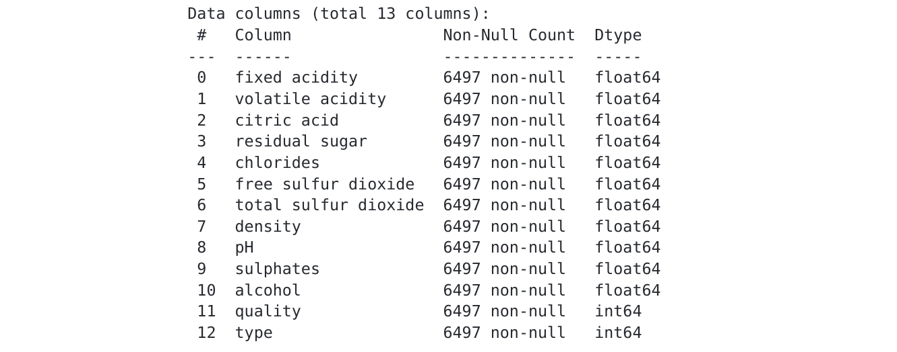
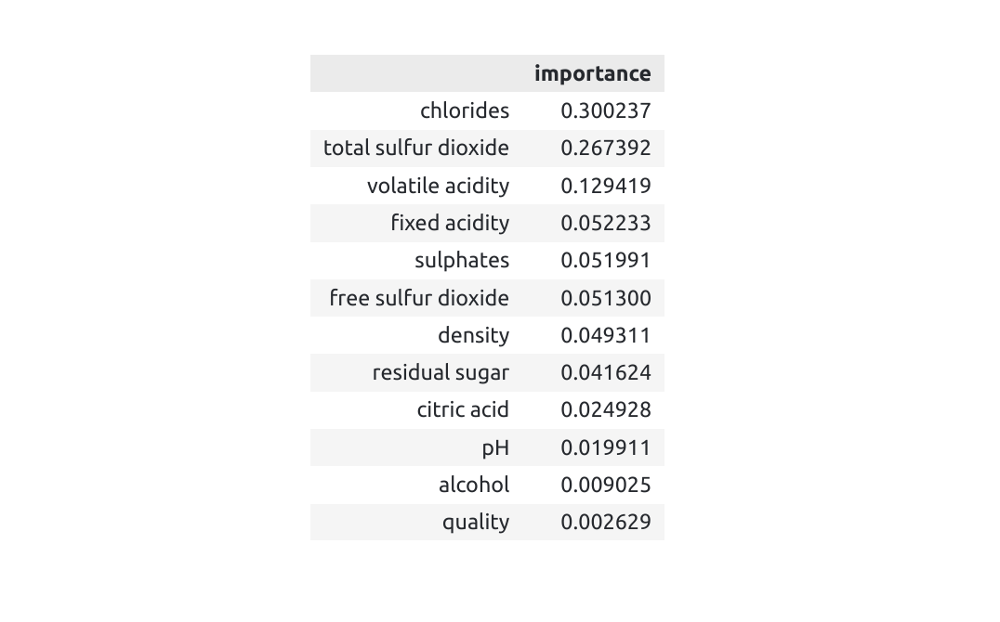
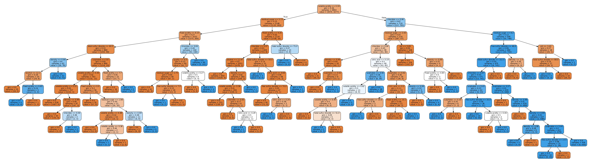
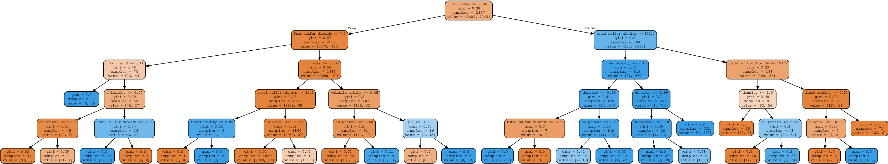
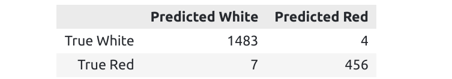

## About Random Forest Classifier

Random Forest is based on binary decision trees. A decision tree is a graphical visualization in the form of a tree of a series of decisions / possibilities. A Random Forest makes it possible to give a probability to each decision: by knowing the probability at each node of the tree, it's feasible to calculate a probability for each result, each "path" followed by the tree. 

The objective is to be able to make a prediction on new data in order to assign them a membership (a class) by knowing only the modalities of the features. Our machine learning model will build a decision tree based on existing data, assigning a probability to each path/exit point combination. For example, and randomly, if the probability of following a certain path is 80% for label ‘Red wine’, each observation that follows this path will be assigned this label (majority voting). It is a simple algorithm to implement, in the sense that a Random Forest combines regression and classification. There is also less chance of overfitting.

**In this post, we are going to see how to use the sklearn random forest classifier to distinguish two categories of wine.**


## Dataset and Classification

The dataset can be downloaded [here](https://www.stat4decision.com/wine_data.csv). It is composed of 13 features for 6497 samples each. The objective is to predict the **type** (number 12) of wine according to the other 12 features (from 0 to 11).



### Code

As usual, we separate our dataset into a training and a testing set using the **train_test_split** function from **sklearn.model_selection**.

```
x_train , x_test, y_train, y_test = train_test_split(x,y, train_size=0.7, random_state=0)
```


### Random Forest Classifier

Selection of the hyperparameters and definition of the random forest classifier. 

```
clf = RandomForestClassifier(
     n_estimators=50, # number of tree in our forest
     criterion='gini', # criterium used : calculates the amount of probability of a specific feature that is classified incorrectly when selected randomly
     max_depth=None, # number of nivels in the tree
     min_samples_split=2,# Minimal number of samples in a leaf to do a separation
     min_samples_leaf=1, # Minimal number of samples to create a leaf
     min_weight_fraction_leaf=0.0, 
     max_features='auto',
     max_leaf_nodes=None,
     min_impurity_decrease=0.0,
     bootstrap=True,# if false, the same sample is used
     oob_score=False,
     n_jobs=None,
     random_state=None,
     verbose=0,
     warm_start=False,
     class_weight=None,
     ccp_alpha=0.0,
     max_samples=None,)

clf.fit(x_train, y_train)
```

We can also see which features has been determinant to classify the wines by plotting the **feature_importances_** of the classifier I named **clf**.


From the table, the chlorides and the total amount of sulfure dioxide are the best features to separate the white from the red wines. 

## Visualization of one tree

As you have maybe noticed in the definition of the classifier, I specified the argument **max_depth** to **None**. This means that the tree continues to grow until all leaves are pure, meaning the leaf will only have labels if you choose "default" for the min_samples_leaf (= 1).

One tree among others will look like that:



Of course, you can also reduce the legnth of the trees by defining a depth value (max_depth = 5): 



**Why changing the depth of the tree?**

- In general, the deeper you let the tree grow, the more complex your model will become, capturing more information about the data. This can lead to **overfitting**. Indeed, our model will fit the training data perfectly and won't be able to generalize well over the data set. Consequently, if our model is overfitted, reducing the number of max_depth is a way of combating overfitting.

- On the other hand, it's not a good idea to have a very low depth either, as our model won't adapt sufficiently: this would be a case of **underfitting**. 

What I usually do is let the model decide on the maximum depth first, then, by comparing training and test results, I decrease or increase the maximum depth.

## Results of the classification

### Accuracy: First validation

It is time now to evaluate our algorithm on the test set. The aim here is to compare the wine color predicted by the model with the ones observed in our test sample. The first indicator used is the percentage of well classified wines, also known as "accuracy".

The **accuracy** or percentage of well classified wine is about **99.44 %**.

### Confusion Matrix: Second validation

To get a more precise idea of the errors made by the algorithm, the confusion matrix can be represented as follows



4 white wines have been predicted as red wines and 7 red have been placed in the white category.


## Conclusions

The Random Forest Classifier :
  - Reduces overfitting in decision trees
  - Works well with categorical and continuous variables!!
  - Improve the accuracy 

But:
  - Using a RFC can also cost a lost in term of time computation depending of the number of features
  - The trees can be really difficult to interpret and are seens as "black-box" if they are really long


### Did you find this page helpful? Consider sharing it 🙌
